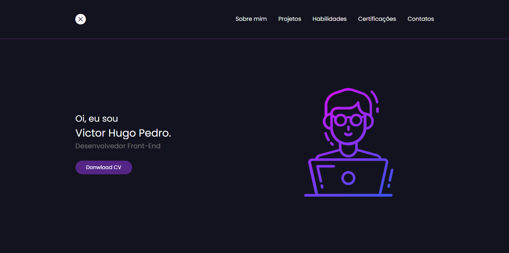

# Portfolio 💼

You can access it with this [link.](https://tubular-paprenjak-9ef2fd.netlify.app/)
# 💻 About the Porfolio 
My portfolio is a valuable collection of work dating back to a significant period in time. Although it was developed a long time ago.

# ⏩ Portfolio 2.0
I am excited to share that I am currently involved in the development of a new portfolio that promises to exceed all expectations. This new project represents a significant leap forward in my professional career and will showcase my honed skills and recent achievements.

# 🚀 Technologies 
Portfolio was developed using the following technologies:

- HTML5
- CSS3
- BootStrap
- JavaScript
- Netlify
# 🛠️ How to install the project and run it on your machine
To install and run the project, follow the steps below:

- Clone this repository to your local environment:
```bash
git clone https://github.com/devpdro/project-portfolio.git
```
- Navigate to the project directory:
```bash
cd project-portfolio
```
